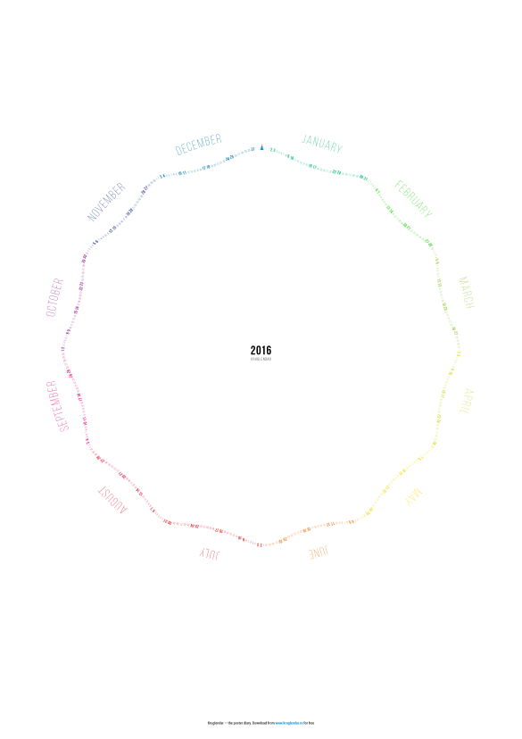

{{ site.title }}
===

{{ site.description }}
{: .description}

{: width="0", height="0"}

Я — [Иван Дианов](http://dianov.org){: target="_blank"}. Делаю круглые календари, на них рисуют и пишут о прошлом и будущем.

В 2015 году на круглендаре названия месяцев были мелкими и повторялись по 30 раз, было сложно найти нужный. «Вынес их за скобки», теперь видно за километр.

{: style="width: 80px; float: right; margin-right: 1em;"}

Даты поставил по гипотрохоиде, такую линию начертит точка на катящейся окружности

{: .teaser}

<a href="src/kruglendar-2016.pdf" class="btn" target="_blank">Скачать круглендарь 2016</a>

1. Распечатайте на формате А1
1. Повесьте на стенку, рядом — фломастер.
1. Отметьте первое событие — появление круглендаря :)

Вот что я делаю со своим календарём:

* Отмечаю фломастером яркие события. В конце года смотрю и радуюсь.
* Планирую поездки и конференции.
* Если жизнь скучнеет, вижу это и принимаю меры.

К концу года он выглядит так:

{: .teaser}

 

Буду благодарен за репост:
 

<!-- -->
<!---->
…или расскажите, как использовали круглендарь в прошлом году. Если сфотографируете — вообще круто!
 
 

